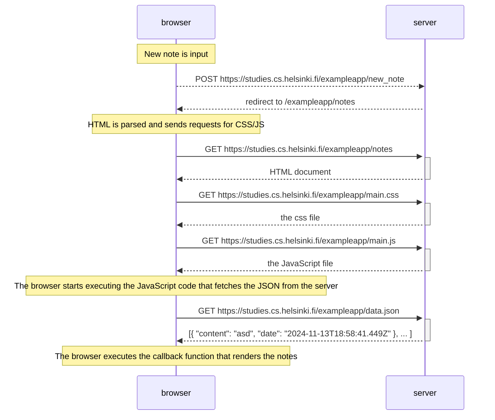

```mermaid
sequenceDiagram
    participant browser
    participant server

    Note over browser: New note is input
    browser-->>server: POST https://studies.cs.helsinki.fi/exampleapp/new_note
    activate server 
    server-->>browser: redirect to /exampleapp/notes
    Note over browser: HTML is parsed and sends requests for CSS/JS
    browser->>server: GET https://studies.cs.helsinki.fi/exampleapp/notes
    activate server
    server-->>browser: HTML document
    deactivate server

    browser->>server: GET https://studies.cs.helsinki.fi/exampleapp/main.css
    activate server
    server-->>browser: the css file
    deactivate server

    browser->>server: GET https://studies.cs.helsinki.fi/exampleapp/main.js
    activate server
    server-->>browser: the JavaScript file
    deactivate server

    Note over browser: The browser starts executing the JavaScript code that fetches the JSON from the server

    browser->>server: GET https://studies.cs.helsinki.fi/exampleapp/data.json
    activate server
    server-->>browser: [{ "content": "asd", "date": "2024-11-13T18:58:41.449Z" }, ... ]
    deactivate server

    Note over browser: The browser executes the callback function that renders the notes
```
