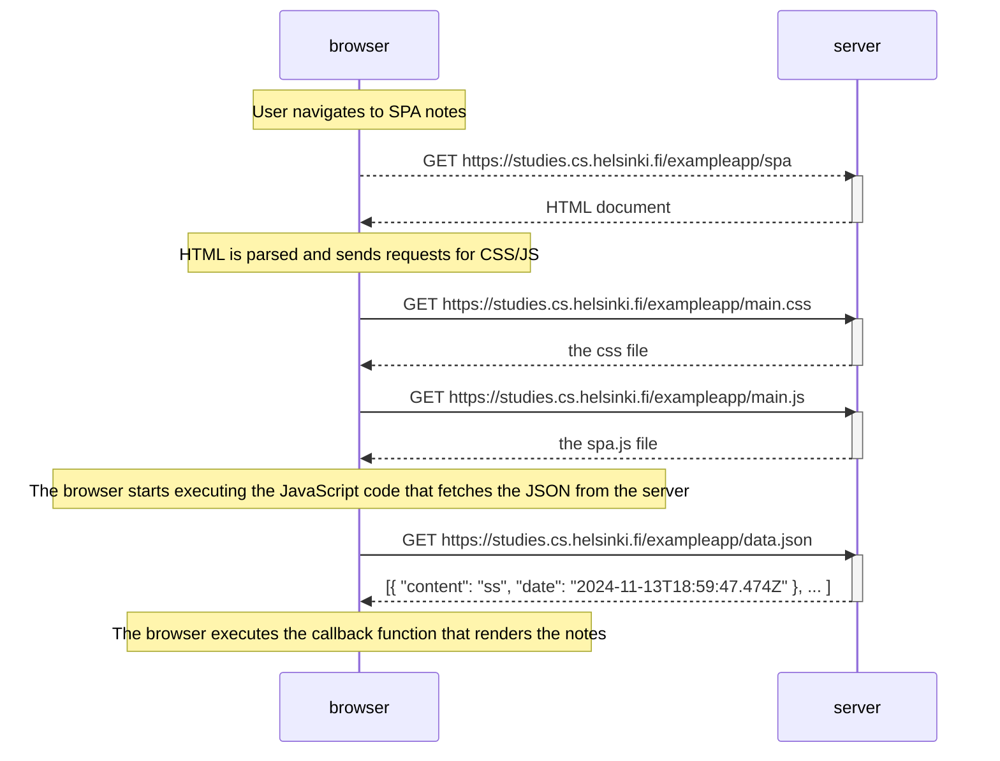

```mermaid
sequenceDiagram
    participant browser
    participant server

    Note over browser: User navigates to SPA notes
    browser-->>server: GET https://studies.cs.helsinki.fi/exampleapp/spa
    activate server
    server-->>browser: HTML document
    deactivate server
    Note over browser: HTML is parsed and sends requests for CSS/JS
    browser->>server: GET https://studies.cs.helsinki.fi/exampleapp/main.css
    activate server
    server-->>browser: the css file
    deactivate server

    browser->>server: GET https://studies.cs.helsinki.fi/exampleapp/main.js
    activate server
    server-->>browser: the spa.js file
    deactivate server

    Note over browser: The browser starts executing the JavaScript code that fetches the JSON from the server

    browser->>server: GET https://studies.cs.helsinki.fi/exampleapp/data.json
    activate server
    server-->>browser: [{ "content": "ss", "date": "2024-11-13T18:59:47.474Z" }, ... ]
    deactivate server

    Note over browser: The browser executes the callback function that renders the notes
```
