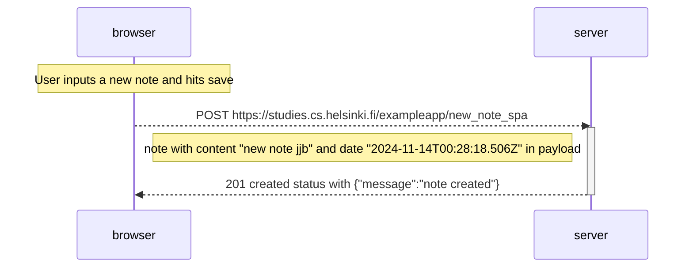

```mermaid
sequenceDiagram
    participant browser
    participant server

    Note over browser: User inputs a new note and hits save
    browser-->>server: POST https://studies.cs.helsinki.fi/exampleapp/new_note_spa
    activate server
    Note right of browser: note with content "new note jjb" and date "2024-11-14T00:28:18.506Z" in payload
    server-->>browser:  201 created status with {"message":"note created"}
    deactivate server
```
